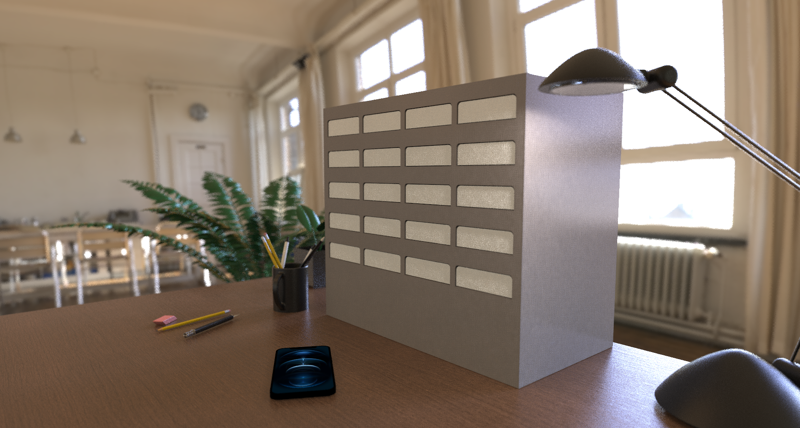

# Phonegetter Device

---

## Содержание

- [Описание](#описание-проекта)
- [Общая архитектура](#общая-архитектура)
- [Схема подключения](#схема-подключения)
- [Установка](#установка)
- [Код для Arduino Mega](#код-для-arduino-mega)
- [Код для ESP8266](#код-для-esp8266)
- [Протокол взаимодействия](#протокол-взаимодействия)

---

## Описание

Бокс для хранения телефонов работает на плате RobotDyn Arduino Mega + ESP8266, которая обеспечивает работу с [API PhoneGetter](https://github.com/PavelFr8/PhoneGetter) 
и [Брокером PhoneGetter](https://github.com/PavelFr8/PhoneGetter_mqtt), а также плата выполняет функции управления телефонами в ячейках и вывода информации на экран Nextion.

---

## Общая архитектура

## Протокол взаимодействия

Взаимодействие между Arduino Mega и ESP8266 осуществляется через интерфейс `Serial3` (UART). Формат команд:  
`<COMMAND>:<PARAM1>:<PARAM2>:...`  
Ответы от ESP8266 передаются в виде текста.

---

## Схема подключения

---

## Arduino Mega

### Функциональность

---

## Код для ESP8266

### Функциональность

